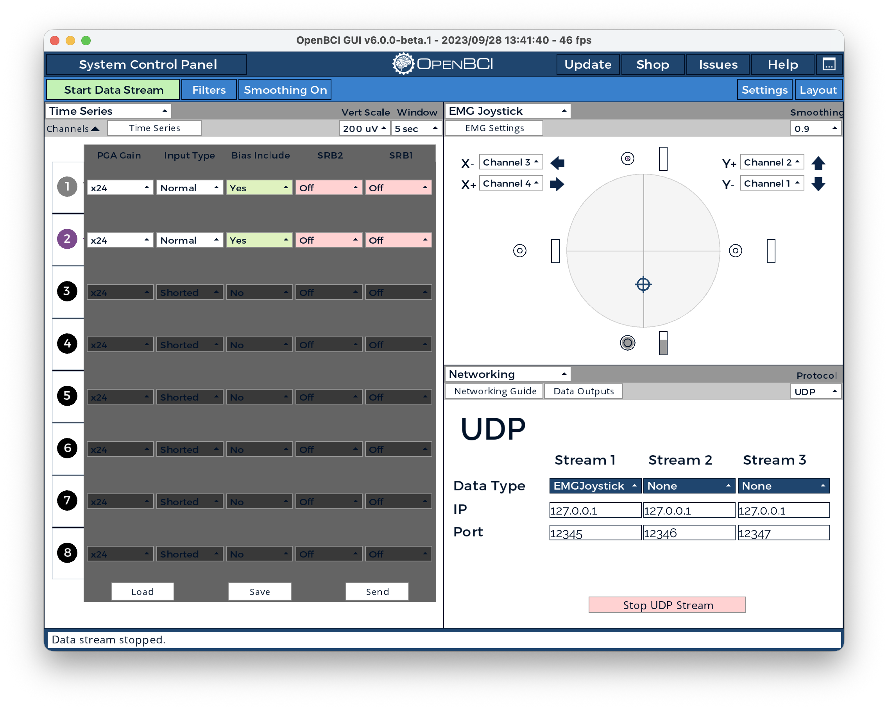
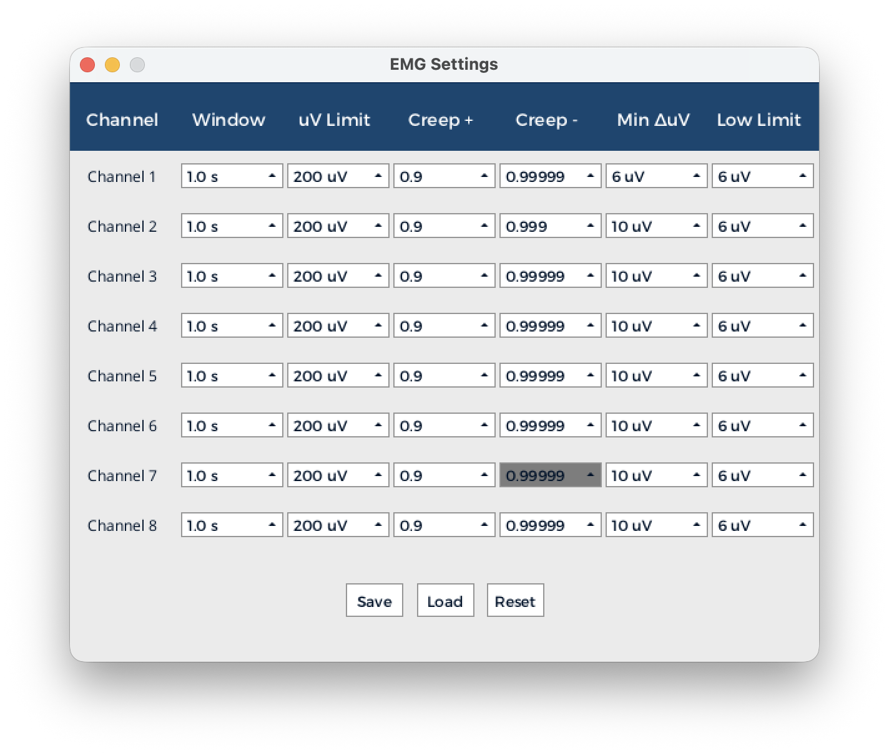
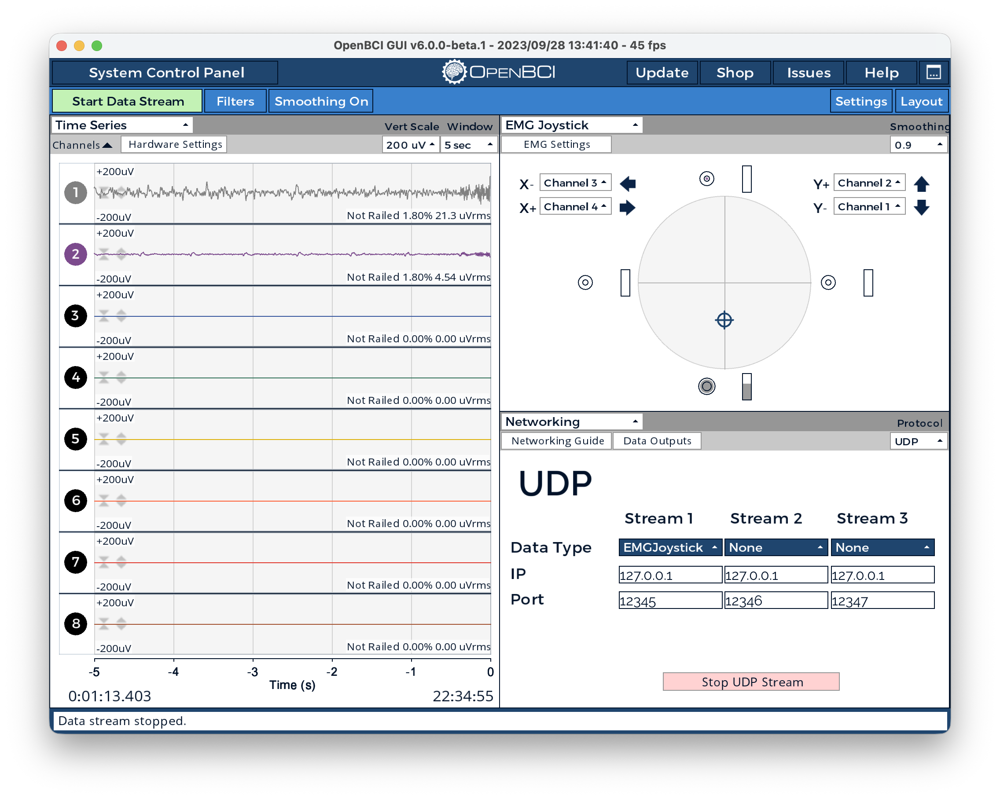

# Simple EMG Pong Game

## What are you making?
I am making a Pong game that can be controlled by moving an arm up and down.

### High-level design
EMG signals from one arm are acquired by the OpenBCI Cyton board and streamed via UDP to a game listener script that controls a simple Pong game.

## How are OpenBCI tools being applied?

### Materials and Coding
- OpenBCI_GUI Version 6 (6.0.0) on Mac.
- Use Cyton Board with only 2 channels + BIAS setup and "PC" mode.
- Gel-based Snap Electrodes and electrode cables.  
- Coding: Python, Copilot.

### Implementation
#### EMG setup
- Follow the NeuroFly toolkit to set up UDP streaming of "EMGJoystick" data.
- Use only the N1P and N2P channels—disabling all others and turning off SRB—to control joystick up (Y+) and down (Y−) movements. The BIAS electrode is used for grounding and noise reduction.
- After experimenting with different arm muscle groups, I found that placing N1P on the biceps, N2P on the triceps, and BIAS near the elbow on the same arm provides the most reliable setup. This configuration produces sufficiently strong EMG signals while minimizing noise and excessive sensitivity, although the resulting movement can feel slightly awkward.

#### Hardware and Software Configuration

The following images document the OpenBCI GUI configuration used for this project:


*OpenBCI Cyton board settings with 2-channel EMG configuration*


*EMG signal processing and filtering parameters*


*Real-time EMG data visualization from N1P (biceps) and N2P (triceps) channels*


#### Game setup
- A Python interface is created to listen to the UDP data stream produced by EMGJoystick.
- A simple Pong game is implemented with pygame, where the game logic parses the streamed data and converts it into upward and downward paddle movements.

#### Run instructions
1. Start OpenBCI GUI, connect to the Cyton board, and configure the Networking widget to stream EMGJoystick data via UDP on port `12345`.
2. Run the `pong_simple_terminal.py` script to start the game.
3. Use arm muscle contractions to control the paddle:
   - Flexing the biceps (increasing EMG signal on N1P) moves the paddle up.
   - Relaxing the biceps and contracting the triceps (increasing EMG signal on N2P) moves the paddle down.
4. The game lasts for 60 seconds, and the objective is to keep the ball in play as long as possible by hitting it with the paddle.

### Game Demo
<video controls>
       <source src="media/game_recording.mov" type="video/mp4">
       Your browser does not support the video tag.
</video>

## Why is this important?
This project represents my first exploration into using EMG signals for game control. My goal is to leverage EMG and EEG technologies to enable people who may not be able to use traditional joysticks to enjoy interactive gaming experiences.


## Game Design Details

### Architecture Overview

```
┌─────────────────────────────────────────────────────────────────┐
│                     EMG Data Source                             │
│              (OpenBCI GUI / NeuroFly App)                       │
│                                                                 │
│  Sends UDP packets:                                             │
│  { "type": "emgJoystick", "data": [x, y] }                      │
└──────────────────────────────┬──────────────────────────────────┘
                               │ UDP Port 12345
                               │
                               ▼
┌─────────────────────────────────────────────────────────────────┐
│                   neurofly.py                                   │
│              UDPClientListener Class                            │
│                                                                 │
│  • Listens on 0.0.0.0:12345                                     │
│  • Parses JSON packets in background thread                     │
│  • Calls registered callback with packet data                   │
└──────────────────────────────┬──────────────────────────────────┘
                               │
                               ▼
┌─────────────────────────────────────────────────────────────────┐
│           pong_simple_terminal.py - Main Game Loop              │
├─────────────────────────────────────────────────────────────────┤
│                                                                 │
│  ┌──────────────────────────────────────────────────────────┐   │
│  │ Global State                                             │   │
│  │  • cmd: paddle direction (-1/+1/0)                       │   │
│  │  • score: current score                                  │   │
│  │  • EMG_THRESHOLD: 0.1                                    │   │
│  └──────────────────────────────────────────────────────────┘   │
│                                                                 │
│  ┌──────────────────────────────────────────────────────────┐   │
│  │ emg_joystick_callback()                                  │   │
│  │  Input: UDP packet { "data": [x, y] }                    │   │
│  │  • Extract data[1] (Y value)                             │   │
│  │  • If y > 0.1: cmd = -1 (move up)                        │   │
│  │  • If y < -0.1: cmd = +1 (move down)                     │   │
│  │  • Else: cmd = 0 (no movement)                           │   │
│  │  Output: Update global cmd variable                      │   │
│  └──────────────────────────────────────────────────────────┘   │
│                                                                 │
│  ┌──────────────────────────────────────────────────────────┐   │
│  │ countdown_sequence()                                     │   │
│  │  Display: 3 → 2 → 1 → GO!                                │   │
│  │  Duration: 4 seconds total                               │   │
│  └──────────────────────────────────────────────────────────┘   │
│                                                                 │
│  ┌──────────────────────────────────────────────────────────┐   │
│  │ Main Game Loop (60 FPS)                                  │   │
│  ├──────────────────────────────────────────────────────────┤   │
│  │                                                          │   │
│  │  Timer Check:                                            │   │
│  │    elapsed_time = (current - start) / 1000               │   │
│  │    remaining_time = 60 - elapsed_time                    │   │
│  │    if remaining_time ≤ 0: exit loop                      │   │
│  │                                                          │   │
│  │  Paddle Logic:                                           │   │
│  │    if cmd ≠ 0:                                           │   │
│  │      paddle.y += cmd * STEP (5 pixels/frame)             │   │
│  │      clamp paddle within screen bounds                   │   │
│  │                                                          │   │
│  │  Ball Physics:                                           │   │
│  │    ball.x += vx                                          │   │
│  │    ball.y += vy                                          │   │
│  │                                                          │   │
│  │    if ball hits top/bottom wall:                         │   │
│  │      vy *= -1 (bounce)                                   │   │
│  │      vy += random(-0.01, 0.01) (slight variation)        │   │
│  │                                                          │   │
│  │    if ball exits left/right:                             │   │
│  │      vx *= -1                                            │   │
│  │                                                          │   │
│  │    if ball collides with paddle AND vx < 0:              │   │
│  │      vx *= -1 (bounce)                                   │   │
│  │      score += 1                                          │   │
│  │                                                          │   │
│  │  Rendering (Pygame):                                     │   │
│  │    • Clear screen (black)                                │   │
│  │    • Draw paddle (white rectangle)                       │   │
│  │    • Draw ball (white circle, radius=8)                  │   │
│  │    • Render score text (top center)                      │   │
│  │    • Render timer text (top right)                       │   │
│  │    • Flip display                                        │   │
│  │                                                          │   │
│  └──────────────────────────────────────────────────────────┘   │
│                                                                 │
│  ┌──────────────────────────────────────────────────────────┐   │
│  │ game_over_screen()                                       │   │
│  │  Display: "GAME OVER" + "Final Score: {score}"           │   │
│  │  Wait for window close                                   │   │
│  └──────────────────────────────────────────────────────────┘   │
│                                                                 │
│  ┌──────────────────────────────────────────────────────────┐   │
│  │ Cleanup (finally block)                                  │   │
│  │  • pygame.quit()                                         │   │
│  │  • listener.stop()                                       │   │
│  └──────────────────────────────────────────────────────────┘   │
│                                                                 │
└─────────────────────────────────────────────────────────────────┘
```

### Data Flow

```
EMG Signal (OpenBCI)
        ↓
   UDP JSON Packet
   { "type": "emgJoystick", 
     "data": [emg_x, emg_y] }
        ↓
   UDPClientListener (background thread)
   └─→ Parse JSON
   └─→ Call emg_joystick_callback()
        ↓
   emg_joystick_callback()
   └─→ Extract emg_y (data[1])
   └─→ Compare to EMG_THRESHOLD (0.1)
   └─→ Set global cmd (-1, 0, or +1)
        ↓
   Main Game Loop
   └─→ Read cmd variable
   └─→ Move paddle accordingly
   └─→ Update physics
   └─→ Render frame
   └─→ Update score
        ↓
   Display (Pygame)
   └─→ Paddle, ball, score, timer
```

### Game States

```
┌─────────────┐
│   START     │
└──────┬──────┘
       │
       ▼
┌──────────────────┐
│ COUNTDOWN (3-2-1)│
│ Duration: 3 sec  │
└──────┬───────────┘
       │
       ▼
┌──────────────────┐
│  GO MESSAGE      │
│  Duration: 1 sec │
└──────┬───────────┘
       │
       ▼
┌──────────────────┐
│  PLAYING         │
│  Duration: 60 sec│
│  FPS: 60         │
└──────┬───────────┘
       │ (timer expires)
       ▼
┌──────────────────┐
│  GAME OVER       │
│  Show final score│
│  Wait for close  │
└──────┬───────────┘
       │
       ▼
┌─────────────┐
│     END     │
└─────────────┘
```

### Key Parameters

| Parameter | Value | Purpose |
|-----------|-------|---------|
| `DEFAULT_UDP_PORT` | 12345 | UDP listener port |
| `EMG_THRESHOLD` | 0.1 | Minimum EMG magnitude to trigger movement |
| `STEP` | 5 | Paddle pixels per frame |
| `GAME_DURATION` | 40 | Game length in seconds |
| `ball_radius` | 8 | Ball display radius in pixels |
| `FPS` | 60 | Game loop frame rate |
| `Screen W × H` | 800 × 500 | Display resolution |
| `Paddle size` | 12 × 100 | Paddle width × height (pixels) |

### Threading Model

```
Main Thread (Pygame)          Background Thread (UDP Listener)
─────────────────────         ─────────────────────────────────
│                             │
├─ pygame.init()              │
├─ Start listener ────────────┼──→ UDPClientListener.start()
│                             │       │
│ Main Game Loop              │       ├─ Bind socket to :12345
│ ├─ Poll events              │       ├─ Loop: recvfrom()
│ ├─ Update game state        │       │   ├─ Parse JSON
│ ├─ Render frame             │       │   └─ Call callback()
│ ├─ Sleep to 60 FPS          │       │
│ └─ Check timer/quit         │       │ (Daemon thread)
│                             │       │
├─ Game Over screen           │ (continues in background)
│                             │
├─ listener.stop() ──────────→├─ Break loop, close socket
├─ pygame.quit()              │
│                             │
└─ Exit                       └─ Exit
```

### Ball Collision Detection

```
Ball Rect (32×32) used for collision checks
but rendered as circle (radius 8)

┌─ Top/Bottom Wall Check
│  if ball.top <= 0 or ball.bottom >= 500:
│      vy *= -1
│      vy += random(-0.01, 0.01)
│
├─ Left/Right Boundary Check
│  if ball.left <= 0 or ball.right >= 800:
│      vx *= -1
│      print("Ball escaped!")
│
└─ Paddle Collision Check
   if ball.colliderect(paddle) and vx < 0:
       vx *= -1
       score += 1
```

### Control Mapping

```
EMG Signal (data[1]) → Paddle Direction

  emg_y ≈ +0.7  (flexed)    →  cmd = -1  →  paddle.y -= 5  (move up)
  emg_y ≈  0.0  (neutral)   →  cmd =  0  →  paddle.y +=  0  (stay)
  emg_y ≈ -0.7  (relaxed)   →  cmd = +1  →  paddle.y += 5  (move down)

Threshold: ±0.1
  If -0.1 < emg_y < 0.1: cmd = 0 (dead zone)
```

### Performance Notes

- **Latency**: UDP callback → global cmd update (< 1ms)
- **Paddle responsiveness**: 60 FPS game loop reads cmd every frame (16.7ms max latency)
- **Ball physics**: Simple linear motion with collision checks
- **Thread safety**: Global `cmd` variable accessed without locking (acceptable for single producer/consumer)

